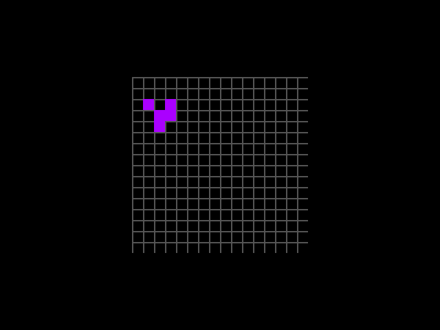

# life-tapeout

[English](README.md) · **中文** · 展示页：[源码](docs/index.html) / [在线](https://claude.ai/artifact/3TVHPVTmZtXJyUWcrEGKW8) · Playground：[源码](tapeout_net/nand-life-bench.html) / [在线](https://claude.ai/artifact/Xcxn2nzNdhSzzX4dGwLQB9)

把 Conway 的生命游戏拆开，在两种完全不同的"流片"上重新搭起来：

| 方向 | 是什么 | 这里有什么 |
|---|---|---|
| **[tapeout.net](https://tapeout.net)** | BSC 链上协议：电路只由两种按 token 计价的元件组成 —— NAND 和 LATCH；任何已流片的电路都可以被别人用 `REF` 复用 | 协议逆向完毕；全网 **27,671** 个链上电路普查、**12,015** 个识别出功能；Life 设计 8×8 只烧 **120 个晶体管**（平铺写法要 3,579 个） |
| **[Tiny Tapeout](https://tinytapeout.com)** | 真实硅片：很多小设计拼在一颗 sky130 芯片上 | Verilog Life 引擎，640×480 VGA 输出，显示器式测试平台 + 金模型比对，已综合估面积 |

起点是对 oimo 的 [Life Universe](https://oimo.io/works/life)（"无限递归"的生命游戏）的逆向。一句话结论：那个页面运行时一步 Life 都不算，是建立在 4 MB 预计算表上的渲染技巧 —— 这正是它无论在链上还是硅片上都流不了片的原因。完整分析见 [docs/research.md](docs/research.md)。



本仓库没有任何东西上过链。所有链上交互都是只读调用，没有连接钱包，没有花任何钱。

## 亮点

- **网表格式逆向并对拍。** tapeout.net 二进制网表（`NAND` / `LATCH` / `REF`）的解码器、编码器和模拟器，用链上已部署电路的 `eval()` 验证过，包括一个用了 `REF` 的电路。
- **全链普查。** 每个项目的每个电路都拉下来，小型组合电路跑真值表，和 39 个参考函数比对。加法器、乘法器、译码器、比较器、popcount 的最小已知实现都列成了表 —— 13,401 个候选里只有 4 个真的用了 `REF`。
- **56 门的 Life 规则电路，穷举验证**，比 Yosys+ABC 的 63 门更省。另一个变体复用链上现成的 55 门 popcount，自己只需要 12 个 NAND。
- **顶层零门的棋盘。** N² 个 LATCH 存状态，每个细胞是一个指向规则电路的 `REF`。为什么这些 LATCH 省不掉，文档里有论证。
- **可直接发送的 calldata**，对链空跑验证过：模拟的 `tapeout()` 调用恰好 revert 在销毁 token 那一步（`ERC1155InsufficientBalance`），说明编码确实到达了正确的函数。
- **官网画布贵 3 倍。** 把规则电路导出成 BLIF 导入官方画布，能导入、能过自检，但画布把每个 NAND 编译成 3 个门（170 对 56）。直接发 calldata 才是省钱的路线。
- **两个交互页面。** [playground](tapeout_net/nand-life-bench.html) 在浏览器里跑同一份网表，可以实时探测单个细胞的 56 个门；还有一个中英双语的[展示页](docs/index.html)。

## 目录结构

```
tapeout_net/            tapeout.net 方向
  README.md / README.en.md   完整报告（中文 / English）
  scan/                 脚本：网表编解码 + 模拟器、普查、Life 构建、calldata、BLIF 导出
  scan/out/             生成的网表（.hex）、BLIF、calldata.json
  nand-life-bench.html  浏览器 playground
  life_core.v           不用 REF 的基线，用于 Yosys 数 NAND
src/                    Tiny Tapeout Verilog（tt_um_brucelanlan_life）
test/                   Icarus 测试平台 + 金模型比对 / GIF 渲染
synth/                  Yosys 脚本，sky130 面积估算
docs/                   研究笔记、展示页、VGA 截图
info.yaml               Tiny Tapeout 项目元数据（草稿）
```

## 快速开始

Node 22+，无依赖。

```sh
cd tapeout_net/scan
npm test                 # 构建两个版本的规则电路和网格并验证（穷举 + 滑翔机）
npm run demo             # 在终端里看滑翔机在网表模拟器里爬
npm run calldata         # 打印规则电路的 mint / tapeout calldata（不发送）
npm run census           # 重新扫链（公共 RPC 上约一小时）
```

Verilog 方向（`iverilog`、Python 3 + numpy、`ffmpeg`）：

```sh
mkdir -p sim
iverilog -g2012 -o sim/tb.vvp test/tb.v src/tt_um_brucelanlan_life.v
cd sim && vvp -n tb.vvp && python3 ../test/check_and_render.py 16
```

16×16 全量在 Icarus 里约 22 分钟（288 帧；266 次代际转换，0 不一致）。给 `vvp` 加 `+short` 可以快速跑；或者用 `-Ptb.N=8 -Ptb.CSH=5` 编译并给 Python 脚本传 `8` 跑 8×8。

面积估算：

```sh
./synth/fetch_lib.sh && yosys -s synth/synth_16.ys
```

| 网格 | 单元数 | 面积（sky130_fd_sc_hd） | Tiny Tapeout 格数（估计） |
|---|---|---|---|
| 8×8 | 1,723 | 1.62 万 µm² | 1×2 |
| 16×16 | 5,955 | 5.46 万 µm² | 3×2 |

## Tiny Tapeout 引脚

| 引脚 | 功能 |
|---|---|
| `ui_in[0]` | 运行 |
| `ui_in[1]` | 单步（上升沿 = 一代） |
| `ui_in[2]` | 装载预设（上升沿） |
| `ui_in[4:3]` | 预设：0 滑翔机，1 R-pentomino，2 LWSS，3 随机 |
| `ui_in[7:5]` | 速度：每 2^speed 帧一代 |
| `uo_out` | TinyVGA PMOD `{hsync, B0, G0, R0, vsync, B1, G1, R1}` |
| `uio_out` | 代数计数器 |

时钟 25.175 MHz（25 MHz 在大多数显示器上也能用）。

## 状态，以及有意没做的事

- 两个方向都没有真正流片。tapeout.net 的 calldata 已生成并空跑验证，mint 和发送由仓库所有者决定；Tiny Tapeout 的 GDS 流程（OpenLane）没有跑，格数是估计值。
- 链上 `beat()` 的真实 gas 是从 `eval()` 实测外推的（约每门 2,468 gas）；挖矿合约的 1,200 万 `maxRunGas` 是否也约束 `beat()`，没能确认。

## 许可

[MIT](LICENSE)。
